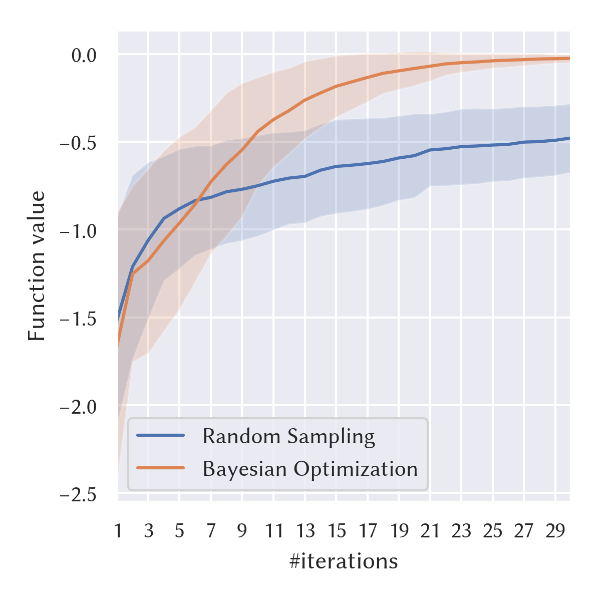

# bayesian-optimization

Bayesian optimization (BO) is a black-box global optimization algorithm. During the iterative process, this algorithm determines the next sampling point based on Bayesian inference of the latent function.

BO is likely to find a reasonable solution with fewer function evaluations than other optimization algorithms. Thus, it is suitable for problems with expensive-to-evaluate objective functions.

## Header

```cpp
#include <mathtoolbox/bayesian-optimization.hpp>
```

## Internal Dependencies

- [acquisition-functions](../acquisition-functions)
- [gradient-descent](../gradient-descent)
- [gaussian-process-regression](../gaussian-process-regression/)

## Math and Algorithm

### Problem Formulation

This implementation is for solving maximization problems in the following form:
$$
\mathbf{x}^{*} = \mathop{\rm arg~max}\limits_{\mathbf{x} \in \mathcal{X}} \: f(\mathbf{x}),
$$
where $\mathbf{x} \in \mathbb{R}^{n}$ represents search variables, $\mathcal{X} \subset \mathbb{R}^{n}$ is the search space, and $f : \mathcal{X} \rightarrow \mathbb{R}$ is the objective function to be maximized.

Currently, this implementation assumes that the search space $\mathcal{X}$ is a hyperrectangle represented as
$$
\mathcal{X} = \{ \mathbf{x} \mid l_{i} \leq x_{i} \leq u_{i}, i = 1, \ldots, n \}.
$$

### Surrogate Function Representation

This implementation assumes the Gaussian process prior. That is, it performs Gaussian process regression using the observed data.

(TODO)

### Acquisition Functions

Currently, it supports the expected improvement (EI) function only.

(TODO)

## Examples

### Optimizing a One-Dimensional Function


### Performance

The following plot shows a result of optimizing a simple objective function:
$$
\max_{\mathbf{x} \in [-1, 1]^{5}} \{ - \| \mathbf{x} \|^{2} \}
$$
50 times with random initial solutions. As a baseline, it also shows a result by the same setting except for using random uniform sampling instead of BO.



```cpp
// Define the target problem
const int  num_dims    = 5;
const auto f           = [](const Eigen::VectorXd& x) { return - x.squaredNorm(); };
const auto lower_bound = Eigen::VectorXd::Constant(num_dims, -1.0);
const auto upper_bound = Eigen::VectorXd::Constant(num_dims, +1.0);

// Instantiate an optimizer
mathtoolbox::BayesianOptimizer optimizer{f, lower_bound, upper_bound};

// Perform optimization iteration
for (int i = 0; i < 50; ++i) { optimizer.Step(); }

// Retrieve the found solution
const Eigen::VectorXd x_star = optimizer.GetCurrentSolution();
```

## Useful Resources

- Yuki Koyama, Issei Sato, Daisuke Sakamoto, and Takeo Igarashi. 2017. Sequential line search for efficient visual design optimization by crowds. ACM Trans. Graph. 36, 4, pp.48:1--48:11 (2017). DOI: <https://doi.org/10.1145/3072959.3073598>
- Bobak Shahriari, Kevin Swersky, Ziyu Wang, Ryan P. Adams, and Nando de Freitas. 2016. Taking the Human Out of the Loop: A Review of Bayesian Optimization. Proc. IEEE 104, 1, pp.148--175 (2016). DOI: <https://doi.org/10.1109/JPROC.2015.2494218>
- (TODO)
